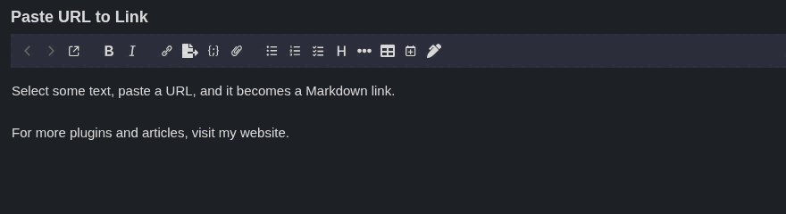

# Paste URL to Link

A Joplin plugin for the Markdown editor: select some text, paste a URL over
it, and the selection becomes a Markdown link, the same behavior as
WordPress's block editor.



Example: select `Joplin` and paste `https://joplinapp.org` → it becomes
`[Joplin](https://joplinapp.org)`.

If the selection is already a Markdown link (`[label](old-url)`), pasting a
new URL updates the link target instead of nesting a new link around it.

Only `http:`, `https:`, `ftp:` and `mailto:` URLs are turned into links. Any
other paste (plain text, several words, no selection, multiple cursors, or a
selection spanning several paragraphs) behaves as usual.

## Requirements

- Joplin desktop 3.7 or later
- The Markdown editor (the plugin does nothing in the Rich Text editor)

## Installation

In Joplin, open **Tools → Options → Plugins**, search for **Paste URL to Link**
and click **Install**.

To install a local build instead, click the gear icon → **Install from file**
and select `publish/com.danielkossmann.pasteUrlToLink.jpl`.

## How it works

The plugin registers a CodeMirror 6 content script
([`src/pasteUrlToLinkEditor.ts`](src/pasteUrlToLinkEditor.ts)) that adds a
transaction filter. Joplin pastes through several paths (CodeMirror's DOM
`paste` handling, Joplin's own Paste command and the editor context menu), but
all of them dispatch a transaction tagged `input.paste`. When such a
transaction replaces a single non-empty selection with a single URL (`http:`,
`https:`, `ftp:`, or `mailto:`, no whitespace), the filter rewrites it into
`[selected text](url)`. Any other paste (plain text, multiple words, no
selection, etc.) is left untouched.

## Build

```bash
npm install
npm run dist
```

This produces `publish/com.danielkossmann.pasteUrlToLink.jpl`.

## Development

For quicker iteration, open **Options → Plugins → Show Advanced Settings** and
add the absolute path of this repository's `dist/` folder to **Development
plugins**. After each `npm run dist`, restart Joplin to load the new build.

## Publishing a release

1. Bump the version with `npm run updateVersion` (keeps `package.json` and
   `src/manifest.json` in sync).
2. Run `npm publish`. The `prepare` script rebuilds `publish/` first.
3. The [Joplin plugin repository](https://github.com/joplin/plugins) picks up
   npm packages named `joplin-plugin-*` with the `joplin-plugin` keyword; the
   new version appears in Joplin within about 30 minutes.

## License

[MIT](LICENSE)
